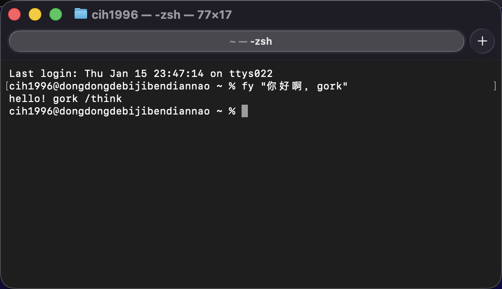

# fy - 智能翻译工具

一个基于 Ollama 的智能翻译 CLI 工具，自动识别中英文并翻译。



## 功能特性

- 🤖 自动检测输入语言（中文/英文）
- 🔄 自动翻译成对应语言
- 📋 支持从剪贴板读取内容
- ⚡ 基于本地 Ollama 服务，快速响应
- 📦 可打包成独立的 CLI 工具

## 前置要求

1. 已安装 Go 1.21 或更高版本
2. 已部署并运行 Ollama 服务（默认地址：http://localhost:11434）
3. 已下载并配置好模型（默认使用 `huihui_ai/qwen3-abliterated:0.6b`，可通过 `-m` 参数指定）

## 安装

### 从源码构建

```bash
# 克隆或下载项目
git clone <repository-url>
cd ollma-qwen-translate/Translate

# 安装依赖
go mod download

# 构建
go build -o fy

# 将可执行文件移动到 PATH 中（可选）
sudo mv fy /usr/local/bin/
```

### 交叉编译

```bash
# Linux
GOOS=linux GOARCH=amd64 go build -o fy-linux

# macOS
GOOS=darwin GOARCH=amd64 go build -o fy-macos

# Windows
GOOS=windows GOARCH=amd64 go build -o fy.exe
```

## 使用方法

### 基本用法

```bash
# 翻译中文到英文
fy "你好"

# 翻译英文到中文
fy "hello"

# 翻译长文本
fy "你好，世界！这是一个测试。"

# 从剪贴板读取内容并翻译
fy -c
```

### 高级选项

```bash
# 指定 Ollama 服务器地址
fy -u http://localhost:11434 "你好"

# 指定使用的模型
fy -m qwen2.5 "hello"

# 组合使用
fy -u http://localhost:11434 -m qwen2.5 "你好世界"
```

## 参数说明

- `-u, --url`: Ollama 服务器地址（默认：http://localhost:11434）
- `-m, --model`: 使用的模型名称（默认：huihui_ai/qwen3-abliterated:0.6b）
- `-c, --clipboard`: 从剪贴板读取内容并翻译

## 语言检测逻辑

工具使用简单的启发式方法检测语言：
- 如果文本中中文字符占比超过 30%，识别为中文，翻译成英文
- 否则识别为英文，翻译成中文

## 故障排除

### Ollama 连接失败

确保 Ollama 服务正在运行：
```bash
# 检查 Ollama 是否运行
curl http://localhost:11434/api/tags
```

### 模型不存在

确保已下载指定的模型：
```bash
# 列出已安装的模型
ollama list

# 下载模型（如果需要）
ollama pull huihui_ai/qwen3-abliterated:0.6b
```

## 开发

```bash
cd Translate

# 运行测试
go test ./...

# 格式化代码
go fmt ./...

# 运行
go run main.go "你好"
```

## 许可证

MIT
